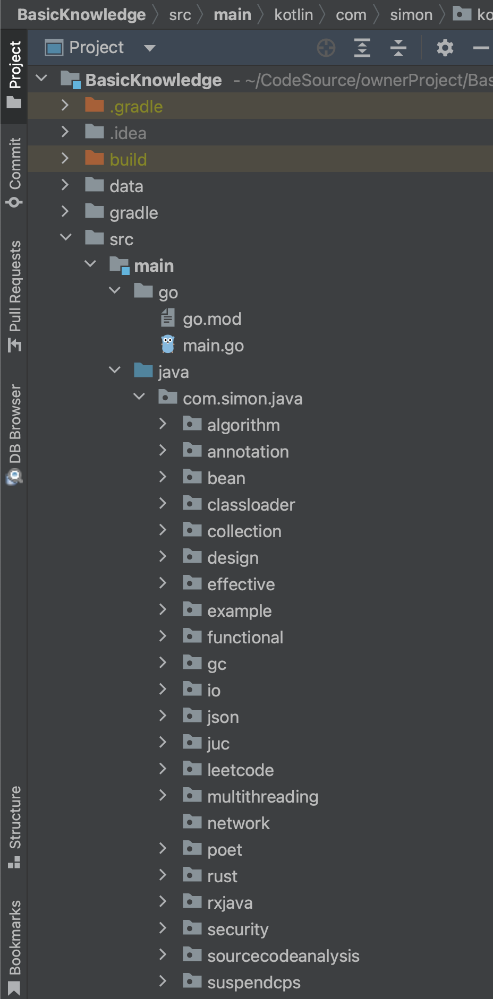
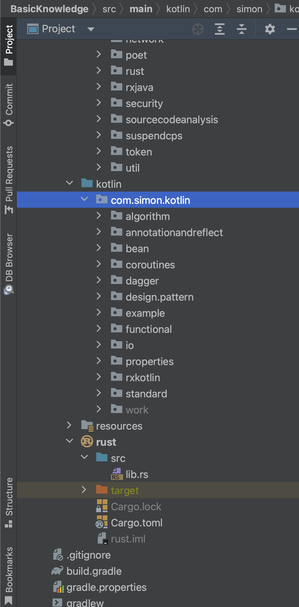
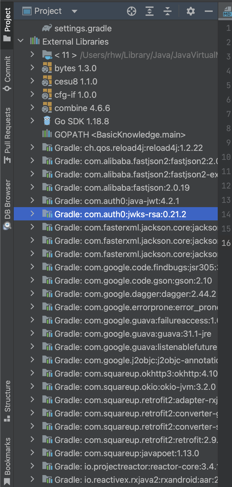
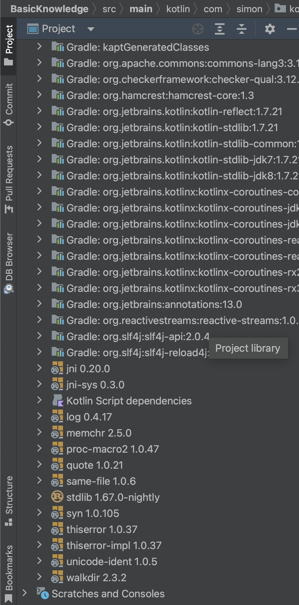

# BasicKnowledge

## 基础知识汇总

 序号  | 语言     | 版本             | 
:----|:-------|:---------------
 1   | Java   | Java 11        | 
 1   | Kotlin | 1.7.21         | 
 1   | Rust   | 1.67.0-nightly |
 1   | Go     | 1.18.8         |

